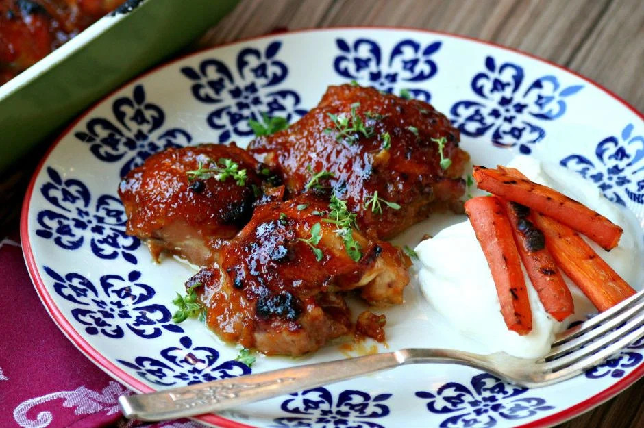

# İçindekiler

1.  [Tavuk Yemekleri](#org08293e8)
    1.  [Kayısı Marmelatlı Tavuk](#org27c7b38)

# Tavuk Yemekleri

## Kayısı Marmelatlı Tavuk

### Besin Değerleri

Bir parçada:

-   159 kcal
-   22 g protein
-   3 g karbonhidrat
-   5 g yağ

### Malzemeler

-   12 tavuk kalça
-   9 yemek kaşığı kayısı marmelatı
-   3 yemek kaşığı soya sosu
-   1.5 yemek kaşığı hardal
-   2 diş sarımsak
-   1 çay kaşığı tuz
-   1 çay kaşığı karabiber

### Tarif

-   Tavukları fırın tepsisine diz.
-   Sos için tüm malzemeleri karıştır.
-   Sosu 5 6 dakika orta ateşte karıştırarak kaynat.
-   Sosu fırındaki tavukların üzerine paylaştır.
-   220 derece fırında 40 dakika pişir.
-   10 dakikada bir fırını açıp dibindeki sosu tavukların üzerine dökerek tavukları ıslat.

